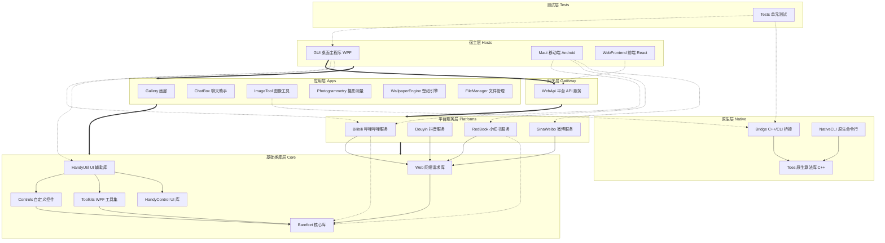

# HamsterStudio

## 模块结构

```mermaid
flowchart TB
    subgraph hosts[宿主层 Hosts]
        direction LR
        gui[GUI 桌面主程序 WPF]
        maui[Maui 移动端 Android]
        webfront[WebFrontend 前端 React]
    end

    subgraph apps[应用层 Apps]
        direction LR
        gallery[Gallery 画廊]
        chatbox[ChatBox 聊天助手]
        imagetool[ImageTool 图像工具]
        photogrammetry[Photogrammetry 摄影测量]
        wallpaper[WallpaperEngine 壁纸引擎]
        filemanager[FileManager 文件管理]
    end

    subgraph gateway[网关层 Gateway]
        webapi[WebApi 平台 API 服务]
    end

    subgraph platforms[平台服务层 Platforms]
        direction LR
        bilibili[Bilibili 哔哩哔哩服务]
        douyin[Douyin 抖音服务]
        redbook[RedBook 小红书服务]
        weibo[SinaWeibo 微博服务]
    end

    subgraph core[基础类库层 Core]
        direction LR
        handyutil[HandyUtil UI 辅助库]
        toolkits[Toolkits WPF 工具集]
        controls[Controls 自定义控件]
        web[Web 网络请求库]
        barefeet[Barefeet 核心库]
        handycontrol[HandyControl UI 库]
    end

    subgraph native[原生层 Native]
        direction LR
        bridge[Bridge C++/CLI 桥接]
        nativecli[NativeCLI 原生命令行]
        toes[Toes 原生算法库 C++]
    end

    subgraph tests[测试层 Tests]
        test[Tests 单元测试]
    end

    hosts ==> apps
    apps ==> core
    gateway ==> platforms
    platforms ==> core

    gui ==> webapi
    webfront -.-> webapi
    gui -.-> bilibili
    gui -.-> handyutil
    maui -.-> bilibili
    maui -.-> redbook
    maui -.-> weibo
    imagetool -.-> bridge

    web --> barefeet
    toolkits --> barefeet
    controls --> barefeet
    handyutil --> controls
    handyutil --> toolkits
    handyutil --> handycontrol
    bilibili --> web
    douyin --> web
    redbook --> web
    weibo --> web
    bilibili -.-> barefeet
    redbook -.-> barefeet
    bridge --> toes
    nativecli --> toes

    test -.-> gui
    test -.-> bridge
```